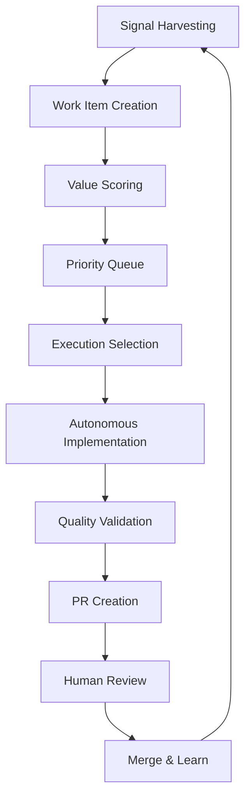

# Terragon Autonomous SDLC System

**Repository:** pno-physics-bench  
**System Version:** 1.0.0  
**Installation Date:** 2025-01-15

## 🤖 Overview

This directory contains the Terragon Autonomous SDLC system implementation for continuous value discovery and execution. The system operates autonomously to discover, prioritize, and execute the highest-value development tasks.

## 📁 Directory Structure

```
.terragon/
├── README.md                    # This file
├── config.yaml                  # Main configuration
├── value-metrics.json           # Execution metrics and history
├── autonomous-discovery.py      # Core discovery engine
├── value-discovery-scheduler.py # Continuous scheduler
├── quality-assessment.py        # Quality validation (to be created)
├── security-assessment.py       # Security validation (to be created)
└── scheduler-state.json         # Scheduler persistent state
```

## 🚀 Quick Start

### Manual Discovery Execution

```bash
# Run single discovery cycle
python .terragon/autonomous-discovery.py

# Check current backlog
cat BACKLOG.md

# View metrics
cat .terragon/value-metrics.json | jq '.valueDelivered'
```

### Continuous Scheduler

```bash
# Start continuous scheduler
python .terragon/value-discovery-scheduler.py --command=start

# Check scheduler health
python .terragon/value-discovery-scheduler.py --command=health

# Trigger manual discovery
python .terragon/value-discovery-scheduler.py --command=trigger --trigger-type=manual --priority=high
```

### Integration with Git Hooks

```bash
# Add post-merge hook for automatic discovery
echo "python .terragon/autonomous-discovery.py" >> .git/hooks/post-merge
chmod +x .git/hooks/post-merge

# Add pre-commit value assessment
pre-commit install
```

## ⚙️ Configuration

The system is configured via `config.yaml` with adaptive settings based on repository maturity:

### Key Configuration Sections

- **scoring.weights**: WSJF, ICE, and technical debt weighting
- **discovery.sources**: Signal harvesting sources and tools
- **execution**: Quality gates and rollback triggers
- **integration**: GitHub, CI/CD, and monitoring integration

### Environment-Specific Overrides

Create environment-specific configs:
- `.terragon/environments/development.yaml`
- `.terragon/environments/staging.yaml`  
- `.terragon/environments/production.yaml`

## 📊 Value Scoring System

The system uses a composite scoring algorithm combining:

### WSJF (Weighted Shortest Job First)
```
WSJF = Cost of Delay / Job Size
Cost of Delay = User Value + Time Criticality + Risk Reduction + Opportunity
```

### ICE (Impact, Confidence, Ease)
```
ICE = Impact × Confidence × Ease
```

### Technical Debt Score
```
Tech Debt = (Debt Impact + Debt Interest) × Hotspot Multiplier
```

### Composite Score
```
Composite = Σ(weight_i × normalized_score_i) + category_boosts
```

## 🔍 Discovery Sources

The system harvests signals from multiple sources:

1. **Git History Analysis**: TODO/FIXME/HACK markers
2. **Static Code Analysis**: Quality metrics and complexity
3. **Dependency Analysis**: Outdated packages and vulnerabilities
4. **Security Scanning**: Vulnerability databases and tools
5. **Documentation Gaps**: Missing or outdated docs
6. **Performance Monitoring**: Regression opportunities

## 🎯 Execution Pipeline



## 📈 Metrics and Monitoring

### Key Metrics Tracked

- **Value Delivery**: Composite scores and business impact
- **Execution Success**: PR success rate and rollback frequency
- **Discovery Effectiveness**: Items found vs. completed
- **Quality Improvements**: Code quality, security, performance
- **Learning Accuracy**: Estimation vs. actual effort/impact

### Prometheus Integration

The system exposes metrics at `/.terragon/metrics` for Prometheus scraping:

```yaml
# Example metrics
terragon_items_discovered_total{source="git-history"} 45
terragon_value_delivered_total 2847.3
terragon_execution_success_rate 0.92
terragon_queue_length 8
```

### Grafana Dashboards

Pre-configured dashboards are available in:
- `monitoring/grafana-dashboards/terragon-value-dashboard.json`

## 🔐 Security and Compliance

### Security Features

- **Secrets Detection**: Baseline scanning with detect-secrets
- **Dependency Scanning**: Automated vulnerability detection
- **Code Security**: Static analysis with bandit and semgrep
- **Container Security**: Image vulnerability scanning

### Compliance Tracking

- **SBOM Generation**: Software Bill of Materials
- **Audit Trails**: Complete execution history
- **Access Control**: RBAC for system operations
- **Data Privacy**: No PII collection or storage

## 🛠️ Development and Customization

### Adding New Discovery Sources

```python
# In autonomous-discovery.py
async def _discover_from_custom_source(self) -> List[WorkItem]:
    """Add custom discovery logic."""
    items = []
    # Your discovery logic here
    return items

# Register in discover_work_items()
custom_items = await self._discover_from_custom_source()
discovered_items.extend(custom_items)
```

### Custom Scoring Logic

```python
# Override scoring methods
def _score_custom_criteria(self, item: WorkItem) -> float:
    """Add custom scoring criteria."""
    # Your scoring logic here
    return score
```

### Adding Execution Handlers

```python
# In autonomous-discovery.py
async def _execute_custom_item_type(self, item: WorkItem) -> Dict:
    """Handle custom item types."""
    if item.category == "custom-category":
        # Your execution logic here
        return {"success": True, "changes": "..."}
```

## 🔧 Troubleshooting

### Common Issues

#### Discovery Not Running
```bash
# Check scheduler status
python .terragon/value-discovery-scheduler.py --command=health

# Check logs
tail -f /var/log/terragon-discovery.log

# Restart scheduler
pkill -f value-discovery-scheduler
python .terragon/value-discovery-scheduler.py --command=start --daemon
```

#### Quality Gates Failing
```bash
# Run quality checks manually
python .terragon/quality-assessment.py --verbose

# Check pre-commit hooks
pre-commit run --all-files

# Reset to last known good state
git checkout main
git branch -D auto-value/*
```

#### High False Positive Rate
```bash
# Adjust scoring thresholds in config.yaml
scoring:
  thresholds:
    minScore: 20.0  # Increase minimum score
    maxRisk: 0.5    # Decrease risk tolerance

# Retrain scoring model
python .terragon/retrain-scoring-model.py
```

### Debug Mode

Enable debug logging by setting environment variable:
```bash
export TERRAGON_DEBUG=true
python .terragon/autonomous-discovery.py
```

### Reset System State

```bash
# Backup current state
cp -r .terragon .terragon.backup

# Reset to initial state
rm .terragon/value-metrics.json
rm .terragon/scheduler-state.json
python .terragon/autonomous-discovery.py --initialize
```

## 📚 Integration Examples

### GitHub Actions

```yaml
# .github/workflows/terragon.yml
name: Terragon Value Discovery
on:
  pull_request:
    types: [closed]
  schedule:
    - cron: '0 */4 * * *'

jobs:
  discovery:
    runs-on: ubuntu-latest
    steps:
      - uses: actions/checkout@v4
      - name: Run Discovery
        run: python .terragon/autonomous-discovery.py
```

### Docker Deployment

```dockerfile
# Dockerfile.terragon
FROM python:3.9-slim
COPY .terragon/ /app/.terragon/
COPY requirements.txt /app/
RUN pip install -r /app/requirements.txt
CMD ["python", "/app/.terragon/value-discovery-scheduler.py", "--daemon"]
```

### Kubernetes CronJob

```yaml
# k8s/terragon-cronjob.yaml
apiVersion: batch/v1
kind: CronJob
metadata:
  name: terragon-discovery
spec:
  schedule: "0 */4 * * *"
  jobTemplate:
    spec:
      template:
        spec:
          containers:
          - name: terragon
            image: terragon/discovery:latest
            command: ["python", ".terragon/autonomous-discovery.py"]
          restartPolicy: OnFailure
```

## 🎓 Learning and Adaptation

The system continuously learns and adapts:

### Learning Sources
- **Execution Outcomes**: Actual vs. predicted effort and impact
- **Quality Metrics**: Test coverage, performance improvements
- **Human Feedback**: PR reviews and issue comments
- **Business Metrics**: User satisfaction and system reliability

### Adaptation Mechanisms
- **Weight Adjustment**: Scoring model coefficients
- **Threshold Tuning**: Quality gates and risk tolerance
- **Pattern Recognition**: Common task patterns and solutions
- **Velocity Optimization**: Task selection for maximum throughput

## 📞 Support and Maintenance

### Health Monitoring

The system includes comprehensive health monitoring:

```bash
# System health check
python .terragon/value-discovery-scheduler.py --command=health

# Detailed metrics
python .terragon/value-discovery-scheduler.py --command=metrics

# Queue status
python .terragon/autonomous-discovery.py --status
```

### Maintenance Tasks

- **Daily**: Execution queue monitoring and cleanup
- **Weekly**: Value metrics review and adjustment
- **Monthly**: Scoring model retraining and validation
- **Quarterly**: System configuration review and updates

### Emergency Procedures

```bash
# Emergency stop
pkill -f "autonomous-discovery\|value-discovery-scheduler"

# Rollback last changes
git checkout main
git branch -D auto-value/*

# Disable system temporarily
echo "disabled" > .terragon/system-status
```

## 📋 Changelog

### v1.0.0 (2025-01-15)
- Initial implementation
- Core discovery engine
- WSJF + ICE + Technical Debt scoring
- GitHub integration
- Prometheus metrics
- Quality gates and rollback

### Future Roadmap

- **v1.1**: Machine learning-enhanced scoring
- **v1.2**: Multi-repository coordination
- **v1.3**: Advanced security scanning
- **v1.4**: Federated learning across teams
- **v2.0**: Full AI-assisted development

---

*This system operates continuously to maximize value delivery while maintaining code quality, security, and human oversight. For questions or issues, consult the troubleshooting guide or create a GitHub issue with the `terragon-support` label.*