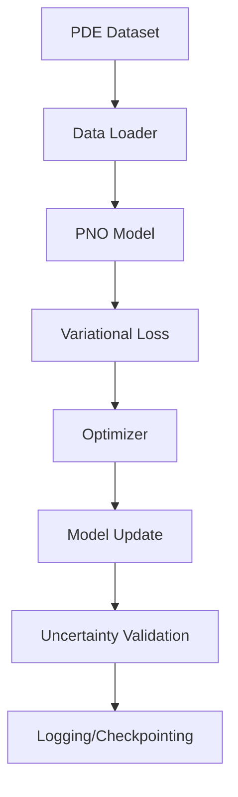
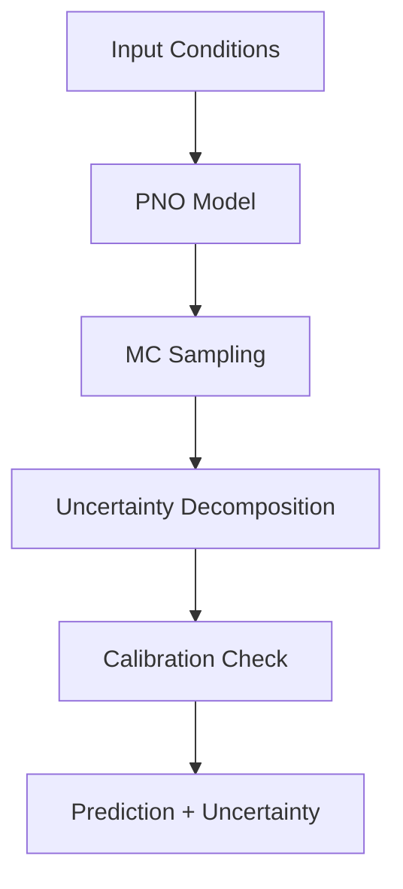

# Architecture Documentation

**Repository:** pno-physics-bench  
**Version:** 0.1.0  
**Last Updated:** 2025-01-15

## 🏗️ System Overview

**pno-physics-bench** is a comprehensive training and benchmarking suite for Probabilistic Neural Operators (PNOs) that quantify uncertainty in neural PDE solvers. The architecture follows modular design principles to support research, experimentation, and production deployment of uncertainty-aware neural operators.

## 🎯 Design Principles

1. **Modularity**: Clear separation between models, training, evaluation, and utilities
2. **Extensibility**: Plugin architecture for new PDE types, uncertainty methods
3. **Reproducibility**: Deterministic training with comprehensive logging
4. **Performance**: Optimized for GPU training and inference
5. **Uncertainty-First**: Built-in uncertainty quantification throughout the pipeline

## 📦 High-Level Architecture

```
┌─────────────────────────────────────────────────────────────┐
│                    pno-physics-bench                        │
├─────────────────────────────────────────────────────────────┤
│  CLI Layer                                                  │
│  ├── pno-train    ├── pno-benchmark    ├── pno-eval        │
├─────────────────────────────────────────────────────────────┤
│  Application Layer                                          │
│  ├── Training     ├── Evaluation      ├── Benchmarking    │
│  ├── Visualization├── Active Learning ├── Serving         │
├─────────────────────────────────────────────────────────────┤
│  Core Components                                            │
│  ├── Models       ├── Uncertainty     ├── Datasets        │
│  ├── Metrics      ├── Physics         ├── Utils           │
├─────────────────────────────────────────────────────────────┤
│  Infrastructure Layer                                       │
│  ├── PyTorch      ├── JAX (optional)  ├── Monitoring      │
│  ├── W&B/TB       ├── Ray Serve       ├── Docker          │
└─────────────────────────────────────────────────────────────┘
```

## 🧩 Core Components

### 1. Models (`src/pno_physics_bench/models/`)

**Probabilistic Neural Operator Architecture**:
```python
ProbabilisticNeuralOperator
├── SpectralConv2d_Probabilistic  # Variational spectral convolution
├── PNOBlock                      # Basic building block
├── UncertaintyHead              # Distributional output layer
└── VariationalLayers            # Bayesian neural network layers
```

**Key Features**:
- **Variational Parameters**: Mean and log-variance for all weights
- **Reparameterization Trick**: Enables gradient-based training
- **Spectral Convolutions**: Fourier-domain operations with uncertainty
- **Multiple Backends**: PyTorch primary, JAX optional

### 2. Uncertainty Quantification (`src/pno_physics_bench/uncertainty/`)

**Uncertainty Types**:
- **Aleatoric**: Data-dependent uncertainty (noise in observations)
- **Epistemic**: Model uncertainty (limited training data)
- **Total**: Combined uncertainty estimate

**Decomposition Methods**:
```python
UncertaintyDecomposer
├── mc_dropout()           # Monte Carlo Dropout
├── deep_ensembles()       # Model ensemble uncertainty  
├── variational_inference() # VI-based uncertainty
└── laplace_approximation() # Laplace method
```

### 3. Training Pipeline (`src/pno_physics_bench/training/`)

**PNOTrainer Architecture**:
```python
PNOTrainer
├── VariationalLoss        # ELBO objective with KL regularization
├── UncertaintyLoss        # NLL + calibration losses
├── PhysicsInformedLoss    # PDE residual constraints
└── AdaptiveScheduler      # Learning rate scheduling
```

**Training Features**:
- **Variational Objective**: Evidence Lower Bound (ELBO) optimization
- **Uncertainty Calibration**: Expected Calibration Error minimization
- **Physics Constraints**: Optional PDE residual penalties
- **Multi-GPU Support**: Distributed training via PyTorch DDP

### 4. Dataset Management (`src/pno_physics_bench/datasets/`)

**Supported PDEs**:
- Navier-Stokes (2D/3D turbulence)
- Darcy Flow (porous media)
- Burgers Equation (1D shock waves)
- Heat Equation (diffusion processes)
- Wave Equation (wave propagation)
- Kuramoto-Sivashinsky (chaotic dynamics)

**Data Pipeline**:
```python
PDEDataset
├── DataLoader             # Efficient batch loading
├── Preprocessor          # Normalization, scaling
├── Augmentation          # Geometric transforms
└── Validation            # Data integrity checks
```

### 5. Evaluation & Metrics (`src/pno_physics_bench/metrics/`)

**Performance Metrics**:
- **Accuracy**: RMSE, MAE, relative error
- **Uncertainty**: NLL, ECE, sharpness, coverage
- **Calibration**: Reliability diagrams, interval scores
- **Robustness**: Out-of-distribution detection

**Specialized Metrics**:
```python
CalibrationMetrics
├── expected_calibration_error()  # ECE computation
├── reliability_diagram()         # Calibration visualization
├── sharpness_score()            # Uncertainty sharpness
└── interval_score()             # Interval prediction accuracy
```

## 🔄 Data Flow Architecture

### Training Pipeline


### Inference Pipeline


## 🚀 Deployment Architecture

### Development Environment
```yaml
Environment:
  - Python 3.9+
  - PyTorch 2.0+
  - CUDA 11.8+ (optional)
  - 16GB+ RAM recommended
  - GPU with 8GB+ VRAM (optional)
```

### Production Serving
```python
# Ray Serve deployment
@serve.deployment(num_replicas=3, ray_actor_options={"num_gpus": 1})
class PNOInferenceServer:
    def __init__(self):
        self.model = ProbabilisticNeuralOperator.load("model.pt")
    
    async def predict(self, input_data):
        mean, std = self.model.predict_distributional(input_data)
        return {"prediction": mean, "uncertainty": std}
```

### Monitoring Stack
- **Prometheus**: Metrics collection
- **Grafana**: Visualization dashboards  
- **W&B/TensorBoard**: Training monitoring
- **Ray Dashboard**: Serving monitoring

## 🧪 Testing Architecture

### Test Structure
```
tests/
├── unit/           # Component unit tests
├── integration/    # End-to-end pipeline tests
├── benchmark/      # Performance regression tests
└── fixtures/       # Test data and configurations
```

### Testing Strategy
- **Unit Tests**: Individual component validation
- **Integration Tests**: Full pipeline testing
- **Property Tests**: Mathematical invariant checking
- **Benchmark Tests**: Performance regression detection
- **GPU Tests**: CUDA-specific functionality

## 📊 Monitoring & Observability

### Training Monitoring
```python
# Weights & Biases integration
wandb.log({
    "train/elbo_loss": elbo_loss,
    "train/kl_divergence": kl_div,
    "train/nll": negative_log_likelihood,
    "val/calibration_error": ece,
    "val/coverage_90": coverage,
    "model/total_params": param_count
})
```

### Production Monitoring
- **Model Performance**: Prediction accuracy, uncertainty calibration
- **System Metrics**: Latency, throughput, resource utilization
- **Data Quality**: Input validation, drift detection
- **Business Metrics**: Usage patterns, error rates

## 🔒 Security Architecture

### Data Security
- **Input Validation**: Comprehensive input sanitization
- **Data Privacy**: No PII storage or logging
- **Encryption**: At-rest and in-transit encryption support

### Model Security
- **Model Integrity**: Cryptographic signatures for model files
- **Dependency Scanning**: Automated vulnerability detection
- **Container Security**: Minimal attack surface in Docker images

### Deployment Security
- **Access Control**: RBAC for model serving endpoints
- **Network Security**: TLS termination, VPC isolation
- **Audit Logging**: Comprehensive request/response logging

## 🚀 Performance Optimization

### Training Optimization
- **Mixed Precision**: Automatic Mixed Precision (AMP) support
- **Gradient Accumulation**: Large effective batch sizes
- **Checkpointing**: Memory-efficient gradient checkpointing
- **Distributed Training**: Multi-GPU and multi-node support

### Inference Optimization
- **Model Compilation**: TorchScript compilation
- **Batch Processing**: Dynamic batching for throughput
- **Caching**: Intelligent result caching
- **Quantization**: INT8 inference support

## 🔮 Future Architecture Considerations

### Scalability
- **Kubernetes Deployment**: Helm charts for orchestration
- **Auto-scaling**: HPA based on prediction load
- **Multi-Region**: Geographic distribution support

### Advanced Features
- **Federated Learning**: Distributed training across institutions
- **Active Learning**: Intelligent data selection
- **Meta-Learning**: Few-shot PDE adaptation
- **Causal Inference**: Physics-guided uncertainty

### Research Extensions
- **Hierarchical PNOs**: Multi-scale uncertainty modeling
- **Graph Neural Operators**: Irregular domain support
- **Quantum Computing**: Quantum-enhanced uncertainty quantification

## 📚 Key Design Decisions

### ADR-001: PyTorch Primary Backend
**Decision**: Use PyTorch as primary deep learning framework  
**Rationale**: Mature ecosystem, research-friendly, strong uncertainty support  
**Alternatives**: JAX/Flax (provided as optional backend)

### ADR-002: Variational Inference for Uncertainty
**Decision**: Implement VI-based uncertainty quantification  
**Rationale**: Principled uncertainty, scalable training, theoretical guarantees  
**Alternatives**: MC Dropout, Deep Ensembles (also supported)

### ADR-003: Spectral Convolutions
**Decision**: Use Fourier Neural Operators as base architecture  
**Rationale**: Parameter efficiency, global receptive field, physics-informed  
**Alternatives**: Standard CNNs, Transformers (for comparison)

### ADR-004: Modular Plugin Architecture
**Decision**: Implement extensible plugin system for PDEs, models, metrics  
**Rationale**: Research flexibility, community contributions, maintainability  
**Alternatives**: Monolithic architecture (rejected for flexibility)

## 🛠️ Development Workflow

### Code Organization
```
src/pno_physics_bench/
├── __init__.py           # Package exports
├── models/               # Neural operator models
├── training/             # Training utilities
├── datasets/             # Data loading and preprocessing
├── uncertainty/          # Uncertainty quantification
├── metrics/              # Evaluation metrics
├── visualization/        # Plotting and dashboards
├── benchmarks/           # Standardized benchmarks
├── physics/              # Physics-informed components
├── serving/              # Production serving
└── utils/                # Common utilities
```

### Configuration Management
- **Hydra Configuration**: Hierarchical config management
- **Environment Variables**: Runtime configuration
- **Config Validation**: Pydantic-based validation
- **Version Control**: Config versioning and migration

## 📈 Performance Characteristics

### Training Performance
- **Single GPU**: ~1000 samples/second (V100)
- **Multi-GPU**: Linear scaling up to 8 GPUs
- **Memory Usage**: ~4GB for standard configuration
- **Convergence**: 50-100 epochs typical

### Inference Performance  
- **Latency**: <50ms per prediction (single sample)
- **Throughput**: >1000 predictions/second (batched)
- **Memory**: <2GB for inference-only deployment
- **Uncertainty Overhead**: ~2x compute vs deterministic

This architecture provides a solid foundation for uncertainty-aware neural PDE solving while maintaining flexibility for research and scalability for production deployment.