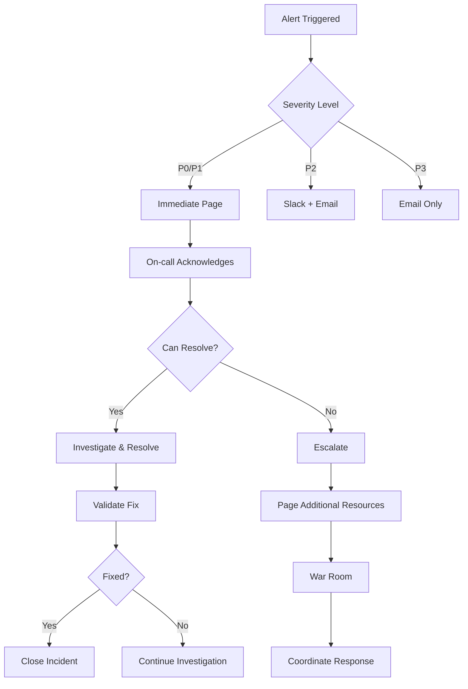

# PNO Physics Bench - Incident Response Procedures

## Overview
Comprehensive incident response procedures for the PNO Physics Bench production environment, covering detection, escalation, resolution, and post-incident analysis.

## Table of Contents
1. [Incident Classification](#incident-classification)
2. [Alert Response Workflows](#alert-response-workflows)
3. [Escalation Procedures](#escalation-procedures)
4. [Communication Protocols](#communication-protocols)
5. [Resolution Playbooks](#resolution-playbooks)
6. [Post-Incident Procedures](#post-incident-procedures)
7. [On-Call Management](#on-call-management)

## Incident Classification

### Severity Levels

#### P0 - Critical (Emergency Response)
**Definition**: Complete service outage or data breach
**Response Time**: 15 minutes
**Examples**:
- All PNO inference endpoints down
- Data breach or security incident
- Data corruption or loss
- Payment system failure

**Response Team**: Incident Commander + On-call Engineer + Security Team (if security-related)

#### P1 - High (Urgent Response)  
**Definition**: Significant service degradation affecting users
**Response Time**: 1 hour
**Examples**:
- P95 response time > 2 seconds
- Error rate > 5%
- Multiple pod crashes
- Authentication system down

**Response Team**: On-call Engineer + Engineering Lead

#### P2 - Medium (Standard Response)
**Definition**: Minor service degradation or single component failure
**Response Time**: 4 hours (business hours)
**Examples**:
- Single pod crash
- Non-critical feature not working
- Monitoring alerts
- Performance degradation < 2x normal

**Response Team**: On-call Engineer

#### P3 - Low (Scheduled Response)
**Definition**: Cosmetic issues or minor problems
**Response Time**: 2 business days
**Examples**:
- Documentation issues
- Minor UI problems
- Non-critical monitoring gaps

**Response Team**: Development Team

### Business Impact Assessment

#### Critical Business Impact
- Service completely unavailable
- Data loss or corruption
- Security breach
- Revenue impact > $10,000/hour

#### High Business Impact
- Significant user experience degradation
- Partial service unavailability
- SLA violations
- Revenue impact $1,000-$10,000/hour

#### Medium Business Impact
- Minor user experience issues
- Internal tool problems
- Revenue impact < $1,000/hour

#### Low Business Impact
- Cosmetic issues
- No revenue impact
- No user experience impact

## Alert Response Workflows

### Automated Alert Processing



### Alert Acknowledgment Process

#### Step 1: Immediate Acknowledgment (0-5 minutes)
1. **Acknowledge Alert**: Respond to pager/notification
2. **Initial Assessment**: Review alert details and severity
3. **Status Update**: Update incident status in system
4. **Resource Check**: Confirm availability and access to tools

#### Step 2: Initial Investigation (5-15 minutes)
1. **Gather Context**: 
   - Review recent deployments
   - Check related alerts
   - Review system dashboards
   - Check external dependencies

2. **Impact Assessment**:
   - Identify affected users/services
   - Estimate business impact
   - Determine if escalation needed

3. **Immediate Actions**:
   - Implement quick fixes if obvious
   - Prevent further degradation
   - Collect initial evidence

### Alert Escalation Triggers

#### Automatic Escalation
- No acknowledgment within 5 minutes (P0/P1)
- No progress update within 30 minutes (P0)
- No progress update within 2 hours (P1)
- Alert severity increases during investigation

#### Manual Escalation
- Investigation reveals broader issue
- Required skills not available in current team
- External vendor involvement needed
- Potential security implications discovered

## Escalation Procedures

### Escalation Matrix

| Role | P0 Response | P1 Response | P2 Response | Contact Methods |
|------|-------------|-------------|-------------|----------------|
| On-Call Engineer | 0-15min | 0-1hr | 0-4hr | Page + SMS + Phone |
| Engineering Lead | 15min | 2hr | Next day | Page + SMS |
| Incident Commander | 30min | 4hr | - | Page + Phone |
| Security Team | 15min (if security) | 1hr (if security) | - | Page + SMS |
| VP Engineering | 1hr | 8hr | - | Phone + Email |
| CTO | 2hr (if ongoing) | Next day | - | Phone + Email |

### Escalation Decision Tree

```python
#!/usr/bin/env python3
# Escalation decision automation
# File: /opt/pno/incident-response/escalation_decision.py

from datetime import datetime, timedelta
from enum import Enum

class Severity(Enum):
    P0 = "critical"
    P1 = "high" 
    P2 = "medium"
    P3 = "low"

class EscalationDecision:
    def __init__(self):
        self.escalation_rules = {
            Severity.P0: {
                'auto_escalate_after': 15,  # minutes
                'commander_required': True,
                'security_eval_required': True
            },
            Severity.P1: {
                'auto_escalate_after': 60,  # minutes
                'commander_required': False,
                'security_eval_required': False
            },
            Severity.P2: {
                'auto_escalate_after': 240,  # minutes (4 hours)
                'commander_required': False,
                'security_eval_required': False
            }
        }
    
    def should_escalate(self, incident):
        """Determine if incident should be escalated"""
        rules = self.escalation_rules.get(incident.severity)
        if not rules:
            return False
        
        # Time-based escalation
        incident_age = datetime.now() - incident.created_at
        if incident_age.total_seconds() / 60 > rules['auto_escalate_after']:
            return True
        
        # Impact-based escalation
        if incident.business_impact == 'critical':
            return True
        
        # Progress-based escalation
        if not incident.progress_updates and incident_age.total_seconds() / 60 > 30:
            return True
        
        return False
    
    def get_escalation_targets(self, incident):
        """Get escalation targets for incident"""
        targets = ['engineering-lead@company.com']
        
        rules = self.escalation_rules.get(incident.severity)
        
        if rules and rules['commander_required']:
            targets.append('incident-commander@company.com')
        
        if rules and rules['security_eval_required']:
            targets.append('security-team@company.com')
        
        if incident.business_impact == 'critical':
            targets.extend([
                'vp-engineering@company.com',
                'cto@company.com'
            ])
        
        return targets
```

## Communication Protocols

### Internal Communication

#### Incident Communication Channels
- **#pno-incidents**: Primary incident coordination
- **#pno-critical-alerts**: Critical alerts only
- **#pno-engineering**: General engineering updates
- **#pno-leadership**: Executive updates

#### Communication Templates

##### Initial Incident Report
```
🚨 INCIDENT ALERT - {{ severity }}

**Service**: PNO Physics Bench
**Time**: {{ incident_time }}
**Severity**: {{ severity }}
**Status**: {{ status }}

**Impact**: {{ impact_description }}
**Affected Systems**: {{ affected_systems }}
**Initial Investigation**: {{ initial_findings }}

**Assigned**: {{ assigned_engineer }}
**IC**: {{ incident_commander }}

**Next Update**: {{ next_update_time }}

Thread: {{ incident_thread_link }}
```

##### Status Update Template
```
📊 INCIDENT UPDATE - {{ incident_id }}

**Time**: {{ update_time }}
**Status**: {{ current_status }}
**Progress**: {{ progress_description }}

**Actions Taken**:
{{ actions_list }}

**Current Focus**:
{{ current_focus }}

**ETA**: {{ estimated_resolution }}
**Next Update**: {{ next_update_time }}
```

##### Resolution Notice
```
✅ INCIDENT RESOLVED - {{ incident_id }}

**Resolution Time**: {{ resolution_time }}
**Total Duration**: {{ total_duration }}
**Root Cause**: {{ root_cause_summary }}

**Resolution Actions**:
{{ resolution_actions }}

**Prevention Measures**:
{{ prevention_measures }}

**Post-Mortem**: {{ postmortem_link }}
```

### External Communication

#### Customer Communication
- **Status Page**: https://status.pno-physics-bench.com
- **Email Notifications**: For affected customers
- **API Notifications**: Programmatic status updates

#### Stakeholder Communication
- **Executive Updates**: For P0/P1 incidents
- **Partner Notifications**: For integration impacts
- **Vendor Coordination**: For third-party issues

## Resolution Playbooks

### Service Outage Playbook

#### PNO Service Completely Down
```bash
#!/bin/bash
# Service outage response playbook
# File: /opt/pno/incident-response/service-outage-playbook.sh

echo "🚨 PNO Service Outage Response Playbook"
echo "======================================="

# Step 1: Verify outage
echo "Step 1: Verifying outage..."
curl -f https://api.pno-physics-bench.com/health
HEALTH_CHECK=$?

if [ $HEALTH_CHECK -eq 0 ]; then
    echo "❌ False alarm - service is responding"
    exit 0
else
    echo "✅ Outage confirmed - proceeding with response"
fi

# Step 2: Check infrastructure
echo "Step 2: Checking infrastructure..."
kubectl get pods -n production -l app=pno-physics-bench
kubectl get svc -n production pno-service
kubectl get ingress -n production pno-ingress

# Step 3: Check recent changes
echo "Step 3: Checking recent deployments..."
kubectl rollout history deployment/pno-physics-bench -n production

# Step 4: Quick recovery attempts
echo "Step 4: Attempting quick recovery..."

# Restart unhealthy pods
kubectl delete pods -n production -l app=pno-physics-bench --field-selector=status.phase!=Running

# Wait for pods to restart
echo "Waiting for pods to restart..."
kubectl wait --for=condition=ready pod -l app=pno-physics-bench -n production --timeout=300s

# Step 5: Verify recovery
echo "Step 5: Verifying recovery..."
sleep 30
curl -f https://api.pno-physics-bench.com/health
if [ $? -eq 0 ]; then
    echo "✅ Service recovered - outage resolved"
    # Post recovery validation
    python /opt/pno/incident-response/validate_recovery.py
else
    echo "❌ Service still down - escalating"
    python /opt/pno/incident-response/escalate_incident.py --severity=P0 --reason="Service restart failed"
fi
```

### High Error Rate Playbook

#### Error Rate Above SLA Threshold
```python
#!/usr/bin/env python3
# High error rate response playbook
# File: /opt/pno/incident-response/high-error-rate-playbook.py

import subprocess
import requests
import time
import logging

logging.basicConfig(level=logging.INFO)
logger = logging.getLogger(__name__)

class HighErrorRateResponse:
    def __init__(self):
        self.prometheus_url = "http://prometheus.monitoring.svc.cluster.local:9090"
        
    def run_playbook(self):
        """Execute high error rate response playbook"""
        logger.info("🚨 High Error Rate Response Playbook")
        logger.info("=" * 40)
        
        # Step 1: Confirm error rate issue
        current_error_rate = self.get_current_error_rate()
        logger.info(f"Current error rate: {current_error_rate:.2%}")
        
        if current_error_rate < 0.01:  # Less than 1%
            logger.info("❌ False alarm - error rate within normal bounds")
            return
        
        # Step 2: Identify error patterns
        error_patterns = self.analyze_error_patterns()
        logger.info(f"Error patterns identified: {len(error_patterns)}")
        
        # Step 3: Check for common causes
        self.check_common_causes()
        
        # Step 4: Implement mitigation strategies
        if current_error_rate > 0.05:  # Greater than 5%
            self.emergency_mitigation()
        else:
            self.standard_mitigation()
        
        # Step 5: Monitor recovery
        self.monitor_recovery()
    
    def get_current_error_rate(self):
        """Get current error rate from Prometheus"""
        query = '''
        sum(rate(http_requests_total{job="pno-physics-bench",status=~"5.."}[5m])) /
        sum(rate(http_requests_total{job="pno-physics-bench"}[5m]))
        '''
        
        try:
            response = requests.get(f"{self.prometheus_url}/api/v1/query", {
                'query': query
            })
            
            if response.status_code == 200:
                data = response.json()
                if data['data']['result']:
                    return float(data['data']['result'][0]['value'][1])
        except Exception as e:
            logger.error(f"Failed to get error rate: {e}")
        
        return 0.0
    
    def analyze_error_patterns(self):
        """Analyze error patterns and types"""
        patterns = []
        
        # Check 5xx error distribution
        error_types_query = '''
        sum by (status) (rate(http_requests_total{job="pno-physics-bench",status=~"5.."}[5m]))
        '''
        
        try:
            response = requests.get(f"{self.prometheus_url}/api/v1/query", {
                'query': error_types_query
            })
            
            if response.status_code == 200:
                data = response.json()
                for result in data['data']['result']:
                    status = result['metric']['status']
                    rate = float(result['value'][1])
                    patterns.append({
                        'type': f'HTTP_{status}',
                        'rate': rate
                    })
        except Exception as e:
            logger.error(f"Failed to analyze error patterns: {e}")
        
        return patterns
    
    def check_common_causes(self):
        """Check for common causes of high error rates"""
        logger.info("Checking common causes...")
        
        # Check resource constraints
        memory_usage = self.get_memory_usage()
        cpu_usage = self.get_cpu_usage()
        
        logger.info(f"Memory usage: {memory_usage:.1f}%")
        logger.info(f"CPU usage: {cpu_usage:.1f}%")
        
        if memory_usage > 90:
            logger.warning("⚠️  High memory usage detected")
            self.scale_deployment("memory pressure")
        
        if cpu_usage > 90:
            logger.warning("⚠️  High CPU usage detected")
            self.scale_deployment("cpu pressure")
        
        # Check recent deployments
        self.check_recent_deployments()
        
        # Check external dependencies
        self.check_external_dependencies()
    
    def emergency_mitigation(self):
        """Emergency mitigation for critical error rates"""
        logger.info("🚨 Implementing emergency mitigation")
        
        # Scale up immediately
        self.scale_deployment("emergency response")
        
        # Consider rollback
        logger.info("Evaluating rollback necessity...")
        recent_deployment = self.get_recent_deployment()
        
        if recent_deployment and self.was_deployed_recently(recent_deployment, hours=2):
            logger.info("Recent deployment detected - initiating rollback")
            self.rollback_deployment()
        
        # Implement circuit breaker
        self.enable_circuit_breaker()
    
    def standard_mitigation(self):
        """Standard mitigation for elevated error rates"""
        logger.info("Implementing standard mitigation")
        
        # Gradual scaling
        self.gradual_scale_up()
        
        # Monitor for improvement
        time.sleep(300)  # Wait 5 minutes
        
        if self.get_current_error_rate() > 0.02:  # Still above 2%
            logger.info("Error rate not improving - escalating response")
            self.emergency_mitigation()
    
    def monitor_recovery(self):
        """Monitor system recovery"""
        logger.info("Monitoring recovery...")
        
        recovery_time_limit = 1800  # 30 minutes
        start_time = time.time()
        
        while time.time() - start_time < recovery_time_limit:
            current_error_rate = self.get_current_error_rate()
            logger.info(f"Current error rate: {current_error_rate:.2%}")
            
            if current_error_rate < 0.001:  # Back to normal
                logger.info("✅ System recovered - error rate back to normal")
                return
            
            time.sleep(60)  # Check every minute
        
        logger.error("❌ System failed to recover within time limit")
        # Escalate to next level
        subprocess.run([
            'python', '/opt/pno/incident-response/escalate_incident.py',
            '--severity=P1', '--reason=Failed to recover from high error rate'
        ])

if __name__ == "__main__":
    playbook = HighErrorRateResponse()
    playbook.run_playbook()
```

### Performance Degradation Playbook

#### Response Time Above SLA
```bash
#!/bin/bash
# Performance degradation response playbook
# File: /opt/pno/incident-response/performance-degradation-playbook.sh

echo "📈 Performance Degradation Response Playbook"
echo "============================================"

# Step 1: Measure current performance
echo "Step 1: Measuring current performance..."
RESPONSE_TIME=$(curl -w "@/opt/pno/curl-format.txt" -s -o /dev/null https://api.pno-physics-bench.com/health)
echo "Current response time: ${RESPONSE_TIME}ms"

# Step 2: Check resource utilization
echo "Step 2: Checking resource utilization..."
kubectl top pods -n production -l app=pno-physics-bench --sort-by=memory
kubectl top nodes

# Step 3: Check for resource constraints
echo "Step 3: Checking for resource constraints..."
python3 << 'EOF'
import subprocess
import json

# Get pod resource usage
result = subprocess.run([
    'kubectl', 'top', 'pods', '-n', 'production', 
    '-l', 'app=pno-physics-bench', '--no-headers'
], capture_output=True, text=True)

total_cpu = 0
total_memory = 0
pod_count = 0

for line in result.stdout.strip().split('\n'):
    if line:
        parts = line.split()
        cpu_usage = int(parts[1].replace('m', ''))
        memory_usage = int(parts[2].replace('Mi', ''))
        
        total_cpu += cpu_usage
        total_memory += memory_usage
        pod_count += 1

if pod_count > 0:
    avg_cpu = total_cpu / pod_count
    avg_memory = total_memory / pod_count
    
    print(f"Average CPU per pod: {avg_cpu:.0f}m")
    print(f"Average memory per pod: {avg_memory:.0f}Mi")
    
    # Recommend scaling if high resource usage
    if avg_cpu > 1500:  # 1.5 cores
        print("⚠️  High CPU usage - recommend scaling up")
    if avg_memory > 3200:  # 3.2GB (80% of 4GB limit)
        print("⚠️  High memory usage - recommend scaling up")
EOF

# Step 4: Check for scaling triggers
echo "Step 4: Checking HPA status..."
kubectl describe hpa pno-hpa -n production

# Step 5: Implement performance improvements
echo "Step 5: Implementing performance improvements..."

# Check if scaling needed
CURRENT_REPLICAS=$(kubectl get deployment pno-physics-bench -n production -o jsonpath='{.spec.replicas}')
echo "Current replicas: $CURRENT_REPLICAS"

if [ $CURRENT_REPLICAS -lt 5 ]; then
    echo "Scaling up deployment..."
    kubectl scale deployment pno-physics-bench --replicas=5 -n production
    kubectl rollout status deployment/pno-physics-bench -n production --timeout=300s
fi

# Step 6: Validate improvement
echo "Step 6: Validating performance improvement..."
sleep 120  # Wait 2 minutes for scaling to take effect

NEW_RESPONSE_TIME=$(curl -w "@/opt/pno/curl-format.txt" -s -o /dev/null https://api.pno-physics-bench.com/health)
echo "New response time: ${NEW_RESPONSE_TIME}ms"

# Check if performance improved
python3 << EOF
old_time = float('$RESPONSE_TIME')
new_time = float('$NEW_RESPONSE_TIME')

improvement = ((old_time - new_time) / old_time) * 100

print(f"Performance improvement: {improvement:.1f}%")

if new_time < 500:  # Under SLA threshold
    print("✅ Performance back within SLA")
elif improvement > 20:  # Significant improvement
    print("🔄 Performance improving - continue monitoring")
else:
    print("❌ No significant improvement - escalate")
    exit(1)
EOF

if [ $? -ne 0 ]; then
    echo "Escalating performance issue..."
    python /opt/pno/incident-response/escalate_incident.py --severity=P1 --reason="Performance degradation not resolved"
fi
```

## Post-Incident Procedures

### Post-Incident Review Process

#### Immediate Post-Resolution (0-24 hours)
1. **Incident Summary**: Create initial incident summary
2. **Impact Assessment**: Calculate business and technical impact
3. **Timeline Creation**: Document incident timeline
4. **Stakeholder Notification**: Inform relevant stakeholders of resolution

#### Post-Mortem Process (1-7 days)
1. **Data Collection**: Gather all relevant data and evidence
2. **Root Cause Analysis**: Conduct thorough investigation
3. **Contributing Factors**: Identify all contributing factors
4. **Action Items**: Create specific, actionable remediation items
5. **Process Review**: Review incident response effectiveness

### Post-Mortem Template

```markdown
# Post-Mortem: [Incident Title]

## Incident Summary
**Date**: [Date]
**Duration**: [Start time] - [End time] ([Duration])
**Severity**: [P0/P1/P2/P3]
**Impact**: [User impact description]

## Timeline
| Time | Event | Actions Taken |
|------|-------|---------------|
| [Time] | [Event description] | [Actions] |

## Root Cause Analysis

### What Happened
[Detailed explanation of what occurred]

### Why It Happened
[Root cause analysis - technical and process factors]

### Contributing Factors
1. [Factor 1]
2. [Factor 2]
3. [Factor 3]

## Impact Assessment

### Users Affected
- [Number/percentage of users affected]
- [Types of users affected]

### Business Impact
- Revenue impact: $[Amount]
- SLA violation: [Yes/No and details]
- Customer complaints: [Number]

### Technical Impact
- Services affected: [List]
- Data integrity: [Any issues]
- Security implications: [Any]

## Response Evaluation

### What Went Well
- [Positive aspects of response]

### What Could Be Improved
- [Areas for improvement]

### Response Timeline
- Time to detection: [Duration]
- Time to acknowledgment: [Duration]
- Time to resolution: [Duration]

## Action Items

| Action Item | Owner | Due Date | Priority | Status |
|-------------|-------|----------|----------|---------|
| [Action description] | [Owner] | [Date] | [P0-P3] | [Status] |

## Lessons Learned
1. [Lesson 1]
2. [Lesson 2]
3. [Lesson 3]

## Prevention Measures
- [Immediate fixes applied]
- [Long-term improvements planned]
- [Process changes implemented]

## Follow-up
- Post-mortem review date: [Date]
- Action item review cadence: [Frequency]
- Next review date: [Date]
```

### Action Item Tracking

```python
#!/usr/bin/env python3
# Post-incident action item tracking
# File: /opt/pno/incident-response/action_item_tracker.py

import json
import datetime
from typing import List, Dict

class ActionItemTracker:
    def __init__(self, data_file="/var/lib/pno/action_items.json"):
        self.data_file = data_file
        self.action_items = self.load_action_items()
    
    def add_action_item(self, incident_id: str, description: str, 
                       owner: str, due_date: str, priority: str):
        """Add new action item from post-mortem"""
        action_item = {
            'id': f"{incident_id}-{len(self.action_items) + 1}",
            'incident_id': incident_id,
            'description': description,
            'owner': owner,
            'due_date': due_date,
            'priority': priority,
            'status': 'open',
            'created_date': datetime.datetime.now().isoformat()
        }
        
        self.action_items.append(action_item)
        self.save_action_items()
        
        return action_item['id']
    
    def update_status(self, action_id: str, status: str, notes: str = ""):
        """Update action item status"""
        for item in self.action_items:
            if item['id'] == action_id:
                item['status'] = status
                item['last_updated'] = datetime.datetime.now().isoformat()
                if notes:
                    item['notes'] = notes
                break
        
        self.save_action_items()
    
    def get_overdue_items(self) -> List[Dict]:
        """Get overdue action items"""
        today = datetime.date.today()
        overdue_items = []
        
        for item in self.action_items:
            if item['status'] != 'completed':
                due_date = datetime.datetime.fromisoformat(item['due_date']).date()
                if due_date < today:
                    overdue_items.append(item)
        
        return overdue_items
    
    def generate_status_report(self) -> Dict:
        """Generate action item status report"""
        total_items = len(self.action_items)
        completed_items = len([i for i in self.action_items if i['status'] == 'completed'])
        overdue_items = len(self.get_overdue_items())
        
        return {
            'total_action_items': total_items,
            'completed_items': completed_items,
            'overdue_items': overdue_items,
            'completion_rate': completed_items / total_items if total_items > 0 else 0,
            'overdue_action_items': self.get_overdue_items()
        }
```

## On-Call Management

### On-Call Schedule
- **Primary On-Call**: 24/7 rotation, 1-week shifts
- **Secondary On-Call**: Backup during business hours
- **Escalation On-Call**: Senior engineers for complex issues

### On-Call Responsibilities

#### Primary On-Call Engineer
- Respond to all P0/P1 alerts within SLA
- Conduct initial investigation and triage
- Coordinate with other teams as needed
- Provide status updates during incidents
- Complete post-incident documentation

#### Secondary On-Call Engineer
- Support primary during complex incidents
- Take over if primary becomes unavailable
- Assist with escalated issues
- Provide expertise for specific domains

### On-Call Tools and Access

#### Required Tools
- PagerDuty mobile app
- Slack mobile app
- Kubernetes cluster access
- Grafana/Prometheus access
- AWS console access
- VPN access for remote work

#### Emergency Contacts
```json
{
  "emergency_contacts": {
    "incident_commander": "+1-555-INCIDENT",
    "engineering_lead": "+1-555-ENG-LEAD", 
    "security_team": "+1-555-SECURITY",
    "vp_engineering": "+1-555-VP-ENG",
    "cto": "+1-555-CTO-PHONE"
  },
  "escalation_slack_channels": [
    "#pno-incidents",
    "#pno-critical-alerts",
    "#engineering-leadership"
  ],
  "external_vendors": {
    "aws_support": "+1-800-AWS-SUPPORT",
    "cloudflare_support": "+1-888-CLOUDFLARE"
  }
}
```

### Handoff Procedures

#### Weekly Handoff Checklist
- [ ] Review open incidents and action items
- [ ] Brief on any ongoing investigations
- [ ] Confirm access to all required systems
- [ ] Test pager and notification systems
- [ ] Review recent changes and deployments
- [ ] Update contact information
- [ ] Confirm backup on-call availability

---

## Continuous Improvement

### Incident Response Metrics
- Mean Time to Detection (MTTD)
- Mean Time to Acknowledgment (MTTA)
- Mean Time to Resolution (MTTR)
- Incident severity distribution
- Escalation rate and reasons
- Customer impact metrics

### Monthly Review Process
- Review all incidents from previous month
- Analyze response effectiveness
- Identify process improvements
- Update playbooks based on lessons learned
- Training needs assessment
- Tool and automation improvements

### Annual Process Review
- Comprehensive incident response audit
- Benchmark against industry standards
- Update escalation matrix and procedures
- Disaster recovery plan validation
- Team training and certification updates

---

## Document Control
- **Document Version**: 1.0.0
- **Created**: August 23, 2025
- **Last Updated**: August 23, 2025
- **Next Review**: November 23, 2025
- **Owner**: Incident Response Team
- **Approved By**: VP Engineering