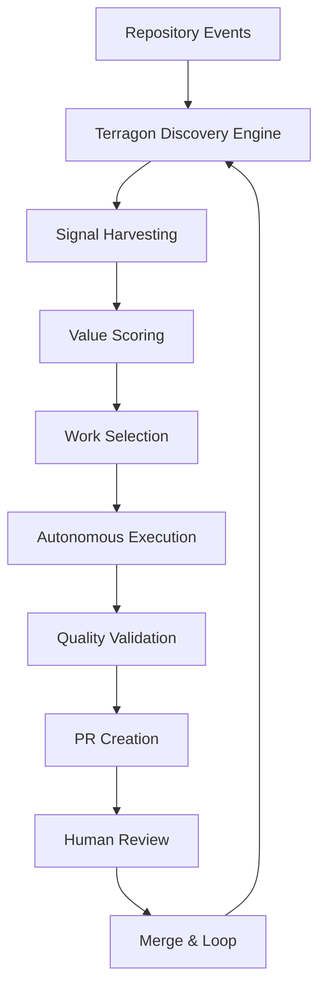
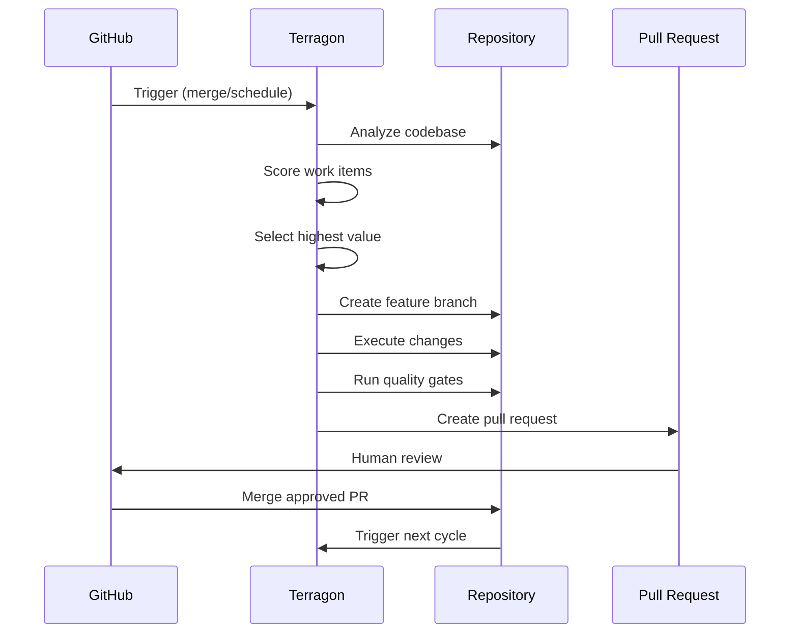

# Autonomous SDLC Integration Guide

**Repository:** pno-physics-bench  
**Terragon System Version:** 1.0  
**Last Updated:** 2025-01-15

## 🤖 Overview

This guide documents the integration requirements for the Terragon Autonomous SDLC system, which provides continuous value discovery and execution for the pno-physics-bench repository.

## 🔧 Integration Architecture



## 📋 Required GitHub Actions Workflows

### 1. Terragon Value Discovery Trigger

**File:** `.github/workflows/terragon-discovery.yml`

```yaml
name: Terragon Value Discovery

on:
  pull_request:
    types: [closed]
    branches: [main]
  schedule:
    - cron: '0 */4 * * *'  # Every 4 hours
  workflow_dispatch:       # Manual trigger

jobs:
  value-discovery:
    if: github.event.pull_request.merged == true || github.event_name == 'schedule' || github.event_name == 'workflow_dispatch'
    runs-on: ubuntu-latest
    
    permissions:
      contents: write
      pull-requests: write
      issues: read
      
    steps:
      - uses: actions/checkout@v4
        with:
          token: ${{ secrets.TERRAGON_TOKEN }}
          
      - name: Setup Python
        uses: actions/setup-python@v4
        with:
          python-version: '3.9'
          
      - name: Install dependencies
        run: |
          pip install pyyaml
          pip install -r requirements.txt
          
      - name: Run Value Discovery
        run: |
          python .terragon/autonomous-discovery.py
          
      - name: Create Autonomous PR
        if: env.TERRAGON_CREATED_PR == 'true'
        uses: actions/github-script@v7
        with:
          github-token: ${{ secrets.TERRAGON_TOKEN }}
          script: |
            const { execSync } = require('child_process');
            const branchName = process.env.TERRAGON_BRANCH_NAME;
            const prTitle = process.env.TERRAGON_PR_TITLE;
            const prBody = process.env.TERRAGON_PR_BODY;
            
            await github.rest.pulls.create({
              owner: context.repo.owner,
              repo: context.repo.repo,
              title: prTitle,
              body: prBody,
              head: branchName,
              base: 'main',
              draft: false
            });
```

### 2. Terragon Quality Gates

**File:** `.github/workflows/terragon-quality-gates.yml`

```yaml
name: Terragon Quality Gates

on:
  pull_request:
    branches: [main]
    paths-ignore:
      - 'docs/**'
      - '*.md'

jobs:
  quality-gates:
    runs-on: ubuntu-latest
    
    steps:
      - uses: actions/checkout@v4
      
      - name: Setup Python
        uses: actions/setup-python@v4
        with:
          python-version: '3.9'
          
      - name: Install dependencies
        run: |
          pip install -r requirements.txt
          pip install -e ".[dev]"
          
      - name: Run Quality Checks
        run: |
          # Code formatting
          black --check src/ tests/
          isort --check src/ tests/
          
          # Linting
          flake8 src/ tests/
          
          # Type checking
          mypy src/
          
          # Security scanning
          bandit -r src/ -f json -o bandit-report.json
          safety check --json --output safety-report.json
          
      - name: Run Tests with Coverage
        run: |
          pytest tests/ --cov=src/pno_physics_bench --cov-report=xml --cov-fail-under=80
          
      - name: Performance Regression Check
        run: |
          pytest tests/benchmark/ --benchmark-only --benchmark-json=benchmark.json
          
      - name: Upload Coverage
        uses: codecov/codecov-action@v3
        with:
          file: ./coverage.xml
          
      - name: Terragon Quality Assessment
        run: |
          python .terragon/quality-assessment.py \
            --coverage-file coverage.xml \
            --benchmark-file benchmark.json \
            --security-reports bandit-report.json,safety-report.json
```

### 3. Terragon Security Scanning

**File:** `.github/workflows/terragon-security.yml`

```yaml
name: Terragon Security Scan

on:
  push:
    branches: [main]
  pull_request:
    branches: [main]
  schedule:
    - cron: '0 6 * * *'  # Daily at 6 AM

jobs:
  security-scan:
    runs-on: ubuntu-latest
    
    permissions:
      security-events: write
      contents: read
      
    steps:
      - uses: actions/checkout@v4
      
      - name: Run Trivy vulnerability scanner
        uses: aquasecurity/trivy-action@master
        with:
          scan-type: 'fs'
          scan-ref: '.'
          format: 'sarif'
          output: 'trivy-results.sarif'
          
      - name: Upload Trivy scan results
        uses: github/codeql-action/upload-sarif@v2
        with:
          sarif_file: 'trivy-results.sarif'
          
      - name: Dependency vulnerability scan
        run: |
          pip install pip-audit safety
          pip-audit --format=json --output=pip-audit.json
          safety check --json --output=safety.json
          
      - name: Container security scan
        if: hashFiles('Dockerfile') != ''
        run: |
          docker build -t pno-physics-bench:latest .
          trivy image --format json --output container-scan.json pno-physics-bench:latest
          
      - name: Terragon Security Assessment
        run: |
          python .terragon/security-assessment.py \
            --trivy-report trivy-results.sarif \
            --pip-audit pip-audit.json \
            --safety-report safety.json \
            --container-scan container-scan.json
```

## 🔐 Required Secrets and Permissions

### GitHub Secrets
```yaml
TERRAGON_TOKEN: Personal access token with repo and workflow permissions
CODECOV_TOKEN: Token for coverage reporting (optional)
SLACK_WEBHOOK: Webhook for notifications (optional)
```

### Repository Permissions
```yaml
Actions: Read and Write
Contents: Write
Issues: Read and Write  
Pull Requests: Write
Security Events: Write
Metadata: Read
```

## 🛠️ Local Development Integration

### Pre-commit Hook Enhancement

Add to existing `.pre-commit-config.yaml`:

```yaml
  # Terragon value assessment
  - repo: local
    hooks:
      - id: terragon-value-check
        name: terragon-value-check
        entry: python .terragon/pre-commit-value-check.py
        language: system
        always_run: true
        require_serial: true
```

### IDE Integration

#### VS Code Settings

**File:** `.vscode/settings.json`

```json
{
  "python.linting.enabled": true,
  "python.linting.flake8Enabled": true,
  "python.linting.mypyEnabled": true,
  "python.formatting.provider": "black",
  "python.sortImports.args": ["--profile", "black"],
  "files.associations": {
    "*.terragon": "yaml"
  },
  "workbench.colorCustomizations": {
    "statusBar.background": "#1e8bc3",
    "statusBar.foreground": "#ffffff",
    "statusBarItem.hoverBackground": "#2997d3"
  },
  "tasks.version": "2.0.0",
  "tasks": [
    {
      "label": "Terragon: Run Value Discovery",
      "type": "shell",
      "command": "python",
      "args": [".terragon/autonomous-discovery.py"],
      "group": "build",
      "presentation": {
        "echo": true,
        "reveal": "always",
        "focus": false,
        "panel": "shared"
      }
    }
  ]
}
```

#### PyCharm Integration

**File:** `.idea/runConfigurations/Terragon_Discovery.xml`

```xml
<component name="ProjectRunConfigurationManager">
  <configuration default="false" name="Terragon Discovery" type="PythonConfigurationType" factoryName="Python">
    <module name="pno-physics-bench" />
    <option name="INTERPRETER_OPTIONS" value="" />
    <option name="PARENT_ENVS" value="true" />
    <envs>
      <env name="PYTHONUNBUFFERED" value="1" />
    </envs>
    <option name="SDK_HOME" value="" />
    <option name="WORKING_DIRECTORY" value="$PROJECT_DIR$" />
    <option name="IS_MODULE_SDK" value="true" />
    <option name="ADD_CONTENT_ROOTS" value="true" />
    <option name="ADD_SOURCE_ROOTS" value="true" />
    <option name="SCRIPT_NAME" value="$PROJECT_DIR$/.terragon/autonomous-discovery.py" />
    <option name="PARAMETERS" value="" />
    <option name="SHOW_COMMAND_LINE" value="false" />
    <option name="EMULATE_TERMINAL" value="false" />
    <option name="MODULE_MODE" value="false" />
    <option name="REDIRECT_INPUT" value="false" />
    <option name="INPUT_FILE" value="" />
    <method v="2" />
  </configuration>
</component>
```

## 📊 Monitoring Integration

### Prometheus Metrics

Add to existing `monitoring/prometheus.yml`:

```yaml
  - job_name: 'terragon-metrics'
    static_configs:
      - targets: ['localhost:9090']
    metrics_path: '/.terragon/metrics'
    scrape_interval: 30s
    scrape_timeout: 10s
```

### Grafana Dashboard

**File:** `monitoring/grafana-dashboards/terragon-value-dashboard.json`

```json
{
  "dashboard": {
    "id": null,
    "title": "Terragon Value Discovery Dashboard",
    "tags": ["terragon", "autonomous", "sdlc"],
    "timezone": "browser",
    "panels": [
      {
        "id": 1,
        "title": "Work Items Discovery Rate",
        "type": "graph",
        "targets": [
          {
            "expr": "rate(terragon_items_discovered_total[5m])",
            "legendFormat": "Items/sec"
          }
        ]
      },
      {
        "id": 2,
        "title": "Value Delivery Score",
        "type": "singlestat",
        "targets": [
          {
            "expr": "terragon_value_delivered_total",
            "legendFormat": "Total Value"
          }
        ]
      },
      {
        "id": 3,
        "title": "Execution Success Rate",
        "type": "graph",
        "targets": [
          {
            "expr": "terragon_execution_success_rate",
            "legendFormat": "Success Rate %"
          }
        ]
      }
    ]
  }
}
```

## 🔄 Continuous Integration Flow

### 1. Event Triggers

- **PR Merge**: Immediate value discovery
- **Scheduled**: Every 4 hours during business hours
- **Manual**: On-demand execution
- **Issue Creation**: Reactive discovery

### 2. Discovery Pipeline



### 3. Quality Gates Integration

All Terragon-generated PRs must pass:

- ✅ Unit tests (80%+ coverage)
- ✅ Integration tests
- ✅ Code quality checks (black, isort, flake8)
- ✅ Type checking (mypy)
- ✅ Security scanning (bandit, safety)
- ✅ Performance regression tests
- ✅ Human code review

## 🚨 Failure Handling

### 1. Automatic Rollback

```python
# .terragon/rollback-handler.py
async def handle_failure(execution_context: Dict):
    """Handle execution failures with automatic rollback."""
    
    if execution_context["validation_failed"]:
        # Rollback code changes
        await git_rollback(execution_context["branch"])
        
        # Create failure issue
        await create_github_issue(
            title=f"Terragon execution failed: {execution_context['item_id']}",
            body=f"Execution failed with error: {execution_context['error']}",
            labels=["terragon-failure", "needs-investigation"]
        )
        
        # Update metrics
        await update_failure_metrics(execution_context)
```

### 2. Human Escalation

Escalate to human intervention when:
- Execution fails 3 times for same item
- Security vulnerabilities detected
- Critical system components affected
- Test coverage drops below threshold

## 📱 Notification Integration

### Slack Integration

```python
# .terragon/notifications.py
async def send_slack_notification(webhook_url: str, message: Dict):
    """Send Slack notification for important events."""
    
    notifications = {
        "high_value_completed": "🎯 High-value work completed: {title}",
        "security_issue_found": "🚨 Security issue discovered: {title}",
        "execution_failed": "❌ Execution failed: {title}",
        "weekly_report": "📊 Weekly value report: {stats}"
    }
```

### Email Reports

```yaml
# .terragon/email-config.yaml
reports:
  weekly:
    enabled: true
    recipients: ["team@company.com"]
    template: "weekly-value-report"
  
  security:
    enabled: true
    recipients: ["security@company.com"]
    template: "security-alert"
```

## 🎛️ Configuration Management

### Environment-Specific Configs

```yaml
# .terragon/environments/development.yaml
execution:
  maxConcurrentTasks: 1
  dryRun: true
  requireApproval: false

# .terragon/environments/production.yaml
execution:
  maxConcurrentTasks: 1
  dryRun: false
  requireApproval: true
```

### Feature Flags

```yaml
# .terragon/feature-flags.yaml
features:
  autonomous_execution: true
  security_scanning: true
  performance_monitoring: true
  automatic_dependency_updates: false
  ai_code_review: false
```

## 🏁 Getting Started

### 1. Initial Setup

```bash
# Install Terragon CLI
npm install -g @terragon/autonomous-sdlc

# Initialize repository
terragon init --repo-type=python-ml --maturity=maturing

# Setup GitHub integration
terragon github setup --token=$GITHUB_TOKEN

# Run first discovery
terragon discover --dry-run
```

### 2. Verification

```bash
# Verify configuration
terragon config validate

# Test discovery engine
terragon discover --limit=5 --dry-run

# Check quality gates
terragon quality-check --all

# Verify integrations
terragon integration test
```

### 3. Monitoring

```bash
# View current backlog
terragon backlog show

# Check execution history
terragon history --last=10

# View metrics
terragon metrics dashboard
```

This integration guide provides the foundation for autonomous SDLC operation while maintaining quality, security, and human oversight. The system operates continuously to discover and execute the highest-value work, adapting to repository maturity and learning from outcomes.